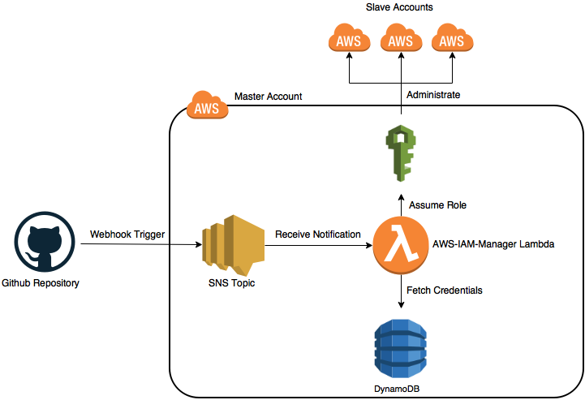
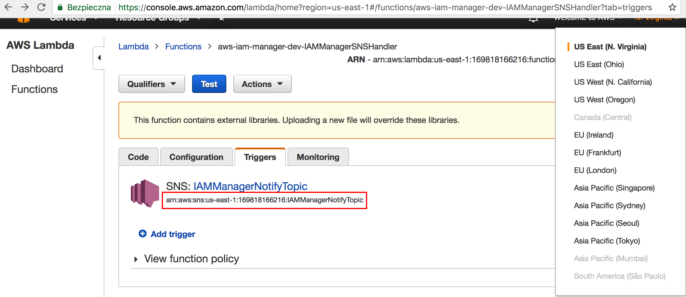

# aws-iam-manager

Manage multiple AWS Account IAM Users, Groups and Policies using Github Repository & Cross-Account access with simple AWS Lambda function based on-top Serverless framework.

### Overview



Basing on repository contents, AWS-IAM-Manager (`AIM`) will create users, assign to specific groups with attached policies.
You can find example repository using #aws-iam-manager here: [https://github.com/RafalWilinski/aws-permissions](https://github.com/RafalWilinski/aws-permissions)

### Prerequisities
- Node.js (preferably LTS)
- Serverless Framework installed globally
- AWS IAM Access/Secret keys set in `~/.aws/credentials` to user with sufficient permissions

### Installation

1. Execute ```serverless deploy``` and wait for results. This will deploy a function receiving events from [Amazon Simple Notification Service](https://aws.amazon.com/sns/). Those events will be sent from Github when your repository contents will change (putting to SNS topic/queue). The function will live in US East (N. Virginia).
2. Navigate to `https://console.aws.amazon.com/iam/home?region=<YOUR_REGION_NAME>#/users/<YOUR_USER>?section=security_credentials` and click `Create access key`. Wait couple seconds to generate and then download generated CSV file or copy `Access Key` & `Secret access key`. You'll need that data to setup Github hook.
3. Navigate to `https://console.aws.amazon.com/lambda/home?region=us-east-1#/functions/aws-iam-manager-dev-IAMManagerSNSHandler?tab=triggers` and copy the value under `SNS: IAMManagerNotifyTopic` like in the image below:  
**Here is where we find SNS Topic Amazon Resource Name**

It will look like this: `arn:aws:sns:us-east-1:<YOUR_AWS_ACC_NUMBER>:IAMManagerNotifyTopic`. Make sure you are in `us-east-1` region, as shown in the picture above.
4. Go to `https://github.com/YOUR_NAME/REPO/settings/hooks/new?service=amazonsns` and fill form with data you retrieved in steps 2 & 3. Lastly, click `Add Service`.
5. Now `aws-iam-manager` will continuously monitor your GitHub repo and reflect changes on AWS accounts.

### Setup
`AIM` is capable of managing accounts with Cross-Account access. In order to do that we need to do three things:

1. Establish a trust relationship between `Slave` account and `Master` Account (account where our Lambda is deployed). [Tutorial how to do that here](http://slides.com/rafalwilinski/deck)
2. Create Policy document allowing our Lambda to assume role of other accounts IAM role. [Tutorial how to do that here](http://slides.com/rafalwilinski/deck-1)
3. Update accounts configuration in DynamoDB table called `aim_roles`. [Tutorial how to do that here](http://slides.com/rafalwilinski/deck-2)


### Repository Structure
##### Files structure

```
/repo_root
├── account_one
|     ├── users.yml
|     ├── groups.yml
|     └── policies.yml
└── account_two
      ├── users.yml
      ├── groups.yml
      └── policies.yml
```

##### Sample files
`users.yml`
```
users:
  - sample.user
  - another.user
```

`policies.yml`
```
policies:
  - name: s3-list-bucket-access-policy
    document:
      Version: '2012-10-17'
      Statement:
        Effect: Allow
        Action: s3:ListBucket
        Resource: arn:aws:s3:::*
```

`groups.yml`
```
groups:
  - name: developers
    policy: s3-list-bucket-access-policy
    users:
      - sample.user
  - name: developers-two
    policy: s3-list-bucket-access-policy
    users:
      - another.user
```

Following setup will create two users, two groups and one policy. User `sample.user` will be joined to `developers` group while `another.user` will be joined to `developers-two` group. Both groups will receive rights to perform `list-buckets` action on all S3 Buckets because of attached `s3-list-bucket-access-policy` policy.


### Private Repositories
In case your repository is private you need to include `access_token` in every request to Github API. To do that, generate new Personal Access Token, copy `secrets.yml.example` to `secrets.yml` (or run `npm run prepare-secrets`) and paste there.

### Local Development
For ease and speed of development it's highly recommended to test code locally using ```npm run invoke``` script which will run function locally with data from `event.json`.

For nicer output you should also consider installing `bunyan` globally. If not, feel free to remove `| bunyan` part from `package.json`.
